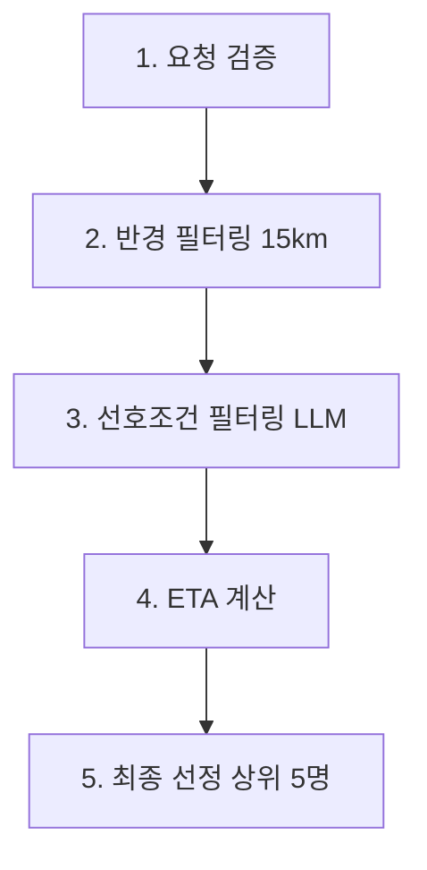

# 위치 기반 요양보호사 매칭 시스템 - 개발 컨텍스트

## 📋 프로젝트 개요

이 프로젝트는 수요자 위치를 기준으로 최적의 요양보호사를 매칭해주는 시스템입니다. 
네이버 지도 API와의 연동을 최소화하고, 효율적인 위치 기반 필터링을 통해 성능을 최적화합니다.

## 🏗️ 시스템 아키텍처

### 현재 구현된 매칭 프로세스 (5단계)



1. **요청 검증**: 서비스 요청 위치 DTO 수신 및 좌표 유효성 검증
2. **반경 필터링**: 15km 반경 내 근거리 후보군 로드 (Haversine 공식 사용)
3. **선호조건 필터링**: LLM으로 조건부합 후보군 생성 ⚠️ **PR #22 연동 예정**
4. **ETA 계산**: 각 위치 간 예상 소요 시간 계산 ⚠️ **현재 임시 구현**
5. **최종 선정**: ETA 기준 정렬 후 상위 5명 선정

## 🛠️ 핵심 구현 파일

### 1. 위치 계산 유틸리티
- **파일**: `app/utils/location_calculator.py`
- **역할**: Haversine 공식 기반 거리 계산, 반경 필터링
- **주요 함수**:
  - `calculate_distance_km()`: 두 지점 간 직선 거리 계산
  - `filter_caregivers_by_distance()`: 반경 내 요양보호사 필터링
  - `calculate_estimated_travel_time()`: 거리 기반 예상 이동시간 계산 (임시)

### 2. 매칭 API
- **파일**: `app/api/matching.py`
- **엔드포인트**: `POST /matching/recommend`
- **역할**: 5단계 위치 기반 매칭 시스템
- **주요 함수**:
  - `recommend_matching()`: 메인 매칭 API 엔드포인트
  - `validate_service_request()`: 요청 검증
  - `load_nearby_caregivers()`: 반경 필터링
  - `filter_by_preferences()`: 선호조건 필터링 (임시)
  - `calculate_travel_times()`: ETA 계산 (임시)
  - `select_final_candidates()`: 최종 선정

### 3. 데이터 모델
- **파일**: `app/models/matching.py`
- **주요 클래스**:
  - `LocationInfo`: 위치 정보 (위도, 경도, 주소 정보)
  - `CaregiverForMatching`: 매칭용 요양보호사 정보
  - `MatchedCaregiver`: 매칭 결과 정보

## 🔄 현재 Stacking Workflow 상태

### PR 의존성 체인
```
PR #20 (gRPC 구현) → PR #21 (네이버 지도 API 스터브) → PR #23 (위치 필터링) → PR #24 (예정)
```

- ✅ **PR #20**: gRPC 서버/클라이언트 구현 완료 (MERGED)
- ✅ **PR #21**: 네이버 지도 API 클라이언트 구현 및 목 데이터 추가
- ✅ **PR #23**: 위치 기반 15km 반경 필터링 시스템 구현 (현재 브랜치: `feat/location-filtering`)

## 🚧 다음 구현 작업

### 우선순위 1: 네이버 지도 Direction 5 API 연동

**목표**: 임시 ETA 계산 로직을 실제 네이버 지도 API를 사용한 정확한 경로 계산으로 교체

#### 구현 상세사항

**1. 네이버 Direction 5 API 클라이언트 확장**
- **파일 수정**: `app/utils/naver_map.py` 또는 새 파일 생성
- **API 엔드포인트**: `https://naveropenapi.apigw.ntruss.com/map-direction/v1/driving`
- **주요 기능**:
  - 출발지 → 목적지 경로 검색
  - 실시간 교통정보 반영된 소요시간 계산
  - API 호출 실패 시 fallback 로직

**2. ETA 계산 로직 교체**
- **파일 수정**: `app/api/matching.py` → `calculate_travel_times()` 함수
- **변경사항**:
  - 현재: `calculate_estimated_travel_time(distance_km)` (거리 기반 추정)
  - 변경 후: 네이버 Direction 5 API 호출하여 실제 소요시간 계산
  - 요양보호사 위치 → 신청자 위치 경로 계산

**3. API 호출 최적화**
- **배치 처리**: 여러 요양보호사의 ETA를 동시에 계산
- **캐싱**: 동일 경로 요청에 대한 결과 캐싱
- **Rate Limiting**: API 호출 제한 준수

#### 예상 구현 코드 구조

```python
# app/utils/naver_direction.py (신규)
async def get_driving_time(origin: LocationInfo, destination: LocationInfo) -> int:
    """네이버 Direction 5 API로 실제 운전 소요시간 계산"""
    pass

async def batch_calculate_eta(
    origins: List[LocationInfo], 
    destination: LocationInfo
) -> List[int]:
    """여러 출발지에서 목적지까지의 ETA를 배치로 계산"""
    pass

# app/api/matching.py (수정)
async def calculate_travel_times(
    qualified_candidates: List[Tuple[CaregiverForMatching, float]], 
    service_location: LocationInfo
) -> List[Tuple[CaregiverForMatching, int, float]]:
    """네이버 Direction 5 API를 사용한 실제 ETA 계산"""
    # 기존 임시 로직 제거
    # 네이버 API 호출 로직으로 교체
    pass
```

#### 새 브랜치 생성
```bash
# 현재 feat/location-filtering 브랜치에서
git checkout -b feat/naver-direction-api
```

#### 새 PR 생성 예정
- **제목**: `feat: 네이버 Direction 5 API를 이용한 실시간 ETA 계산 구현`
- **의존성**: PR #23에 의존

### 우선순위 2: LLM 선호조건 필터링 연동 (PR #22 완료 후)

**목표**: 현재 임시로 모든 후보를 통과시키는 로직을 실제 LLM 기반 필터링으로 교체

### 우선순위 3: 성능 최적화 및 모니터링

**목표**: 대용량 요양보호사 데이터에서의 매칭 성능 최적화

## 🧪 테스트 가이드

### 현재 구현된 기능 테스트

**1. 위치 계산 유틸리티 테스트**
```python
# 거리 계산 정확성 테스트
distance = calculate_distance_km(37.5665, 126.9780, 37.5651, 126.9895)  # 서울시청 → 명동
assert 0.8 <= distance <= 1.2  # 약 1km

# 반경 필터링 테스트
filtered = filter_caregivers_by_distance(center_location, caregivers, 15.0)
```

**2. 매칭 API 테스트**
```bash
curl -X POST "http://localhost:8000/matching/recommend" \
  -H "Content-Type: application/json" \
  -d '{
    "serviceRequest": {
      "serviceRequestId": "test-001",
      "location": {
        "x": 126.9780, "y": 37.5665,
        "roadAddress": "서울특별시 중구 세종대로 110",
        "jibunAddress": "서울특별시 중구 태평로1가 31",
        "addressElements": []
      }
    },
    "candidateCaregivers": [...]
  }'
```

## 🔧 개발 환경 설정

### 필수 dependency 확인
```bash
# requirements.txt에서 확인
pip install fastapi uvicorn pydantic
```

### 환경 변수 설정
```bash
# 네이버 지도 API 키 (추후 Direction API 사용시 필요)
NAVER_CLIENT_ID=your_client_id
NAVER_CLIENT_SECRET=your_client_secret
```

### 서버 실행

**통합 서버 실행 (FastAPI + gRPC)**
```bash
python run_server.py
```

**환경변수 설정 (.env 파일)**
```bash
# 서버 설정
HOST=0.0.0.0
FASTAPI_PORT=8000
GRPC_PORT=50051
LOG_LEVEL=info
```

**서버 구성**:
- **FastAPI**: REST API 서버 (`/matching/recommend`, `/health-check` 등)
- **gRPC**: 고성능 매칭 서비스 (`MatchingService`)
- **통합 실행**: FastAPI의 lifespan 이벤트에서 gRPC 서버 자동 시작/종료

## 📝 코딩 컨벤션

- **함수명**: snake_case 사용
- **클래스명**: PascalCase 사용  
- **상수**: UPPER_SNAKE_CASE 사용
- **비동기 함수**: 모든 API 호출 함수는 `async/await` 사용
- **에러 처리**: 단계별 커스텀 예외 `MatchingProcessError` 사용
- **로깅**: 각 단계별 상세 로그 필수

## 🐛 알려진 이슈 및 TODO

### 현재 임시 구현 (교체 필요)
- ❌ `filter_by_preferences()`: 모든 후보 통과 → LLM 필터링으로 교체
- ❌ `calculate_travel_times()`: 거리 기반 추정 → 네이버 Direction API로 교체

### 성능 최적화 필요
- ⚠️ 대량 요양보호사 데이터 처리 시 메모리 사용량 최적화
- ⚠️ 네이버 API 호출 비용 최적화 (캐싱, 배치 처리)

### 테스트 커버리지 추가 필요
- 📋 단위 테스트: 각 유틸리티 함수
- 📋 통합 테스트: 전체 매칭 프로세스
- 📋 성능 테스트: 1000명 이상 요양보호사 데이터

## 🚀 배포 가이드

### 스테이징 환경 배포
```bash
# Docker 빌드 및 실행 (추후)
docker build -t homecare-matching .
docker run -p 8000:8000 homecare-matching
```

### 프로덕션 배포 체크리스트
- [ ] 네이버 API 키 환경변수 설정
- [ ] 로그 레벨 설정 (INFO → WARNING)
- [ ] 성능 모니터링 설정
- [ ] 에러 알람 설정

---

**마지막 업데이트**: 2025-08-31  
**현재 브랜치**: `feat/location-filtering`  
**다음 작업자**: 네이버 Direction 5 API 연동 담당자