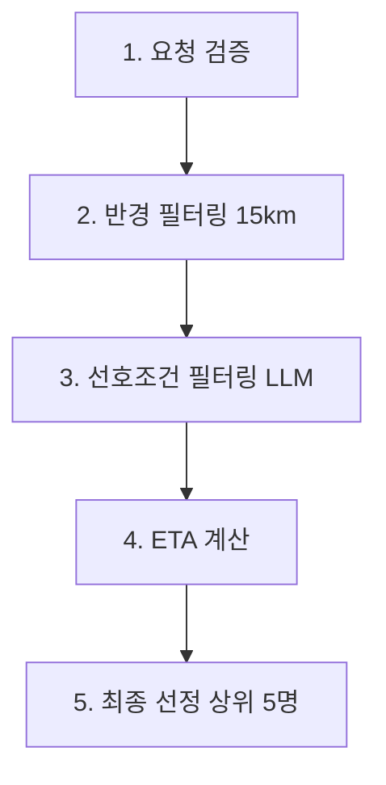

# 위치 기반 요양보호사 매칭 시스템 - 개발 컨텍스트

## 📋 프로젝트 개요

이 프로젝트는 수요자 위치를 기준으로 최적의 요양보호사를 매칭해주는 시스템입니다. 
네이버 지도 API와의 연동을 최소화하고, 효율적인 위치 기반 필터링을 통해 성능을 최적화합니다.

## 🏗️ 시스템 아키텍처

### 현재 구현된 매칭 프로세스 (5단계)



1. **요청 검증**: 서비스 요청 위치 DTO 수신 및 좌표 유효성 검증
2. **반경 필터링**: 15km 반경 내 근거리 후보군 로드 (Haversine 공식 사용)
3. **선호조건 필터링**: LLM으로 조건부합 후보군 생성 ⚠️ **PR #22 연동 예정**
4. **ETA 계산**: 각 위치 간 예상 소요 시간 계산 ⚠️ **현재 임시 구현**
5. **최종 선정**: ETA 기준 정렬 후 상위 5명 선정

## 🛠️ 핵심 구현 파일

### 1. 위치 계산 유틸리티
- **파일**: `app/utils/location_calculator.py`
- **역할**: Haversine 공식 기반 거리 계산, 반경 필터링
- **주요 함수**:
  - `calculate_distance_km()`: 두 지점 간 직선 거리 계산
  - `filter_caregivers_by_distance()`: 반경 내 요양보호사 필터링
  - `calculate_estimated_travel_time()`: 거리 기반 예상 이동시간 계산 (임시)

### 2. 매칭 API
- **파일**: `app/api/matching.py`
- **엔드포인트**: `POST /matching/recommend`
- **역할**: 5단계 위치 기반 매칭 시스템
- **주요 함수**:
  - `recommend_matching()`: 메인 매칭 API 엔드포인트
  - `validate_service_request()`: 요청 검증
  - `load_nearby_caregivers()`: 반경 필터링
  - `filter_by_preferences()`: 선호조건 필터링 (임시)
  - `calculate_travel_times()`: ETA 계산 (임시)
  - `select_final_candidates()`: 최종 선정

### 3. 데이터 모델
- **파일**: `app/models/matching.py`
- **주요 클래스**:
  - `LocationInfo`: 위치 정보 (위도, 경도, 주소 정보)
  - `CaregiverForMatching`: 매칭용 요양보호사 정보
  - `MatchedCaregiver`: 매칭 결과 정보

## 🔄 현재 Stacking Workflow 상태

### PR 의존성 체인
```
PR #20 (gRPC 구현) → PR #21 (네이버 지도 API 스터브) → PR #23 (위치 필터링) → PR #24 (ETA 계산) ✅
```

- ✅ **PR #20**: gRPC 서버/클라이언트 구현 완료 (MERGED)
- ✅ **PR #21**: 네이버 지도 API 클라이언트 구현 및 목 데이터 추가 (MERGED)
- ✅ **PR #23**: 위치 기반 15km 반경 필터링 시스템 구현 (MERGED)
- ✅ **PR #24**: 네이버 Direction 5 API를 이용한 실시간 ETA 계산 구현 (현재 브랜치: `i-10/feat/calculate-eta`) **🚧 완료됨**

## ✅ 최근 완료된 작업 (2025-08-31)

### PR #24: 네이버 Direction 5 API를 이용한 실시간 ETA 계산 구현 

#### 🎯 완료된 구현 사항

**1. 네이버 Direction 5 API 클라이언트 구현**
- **신규 파일**: `app/utils/naver_direction.py`
- **API 엔드포인트**: `https://maps.apigw.ntruss.com/map-direction/v1/driving`
- **주요 기능**:
  - ✅ 실시간 교통정보 반영 (`trafast` 옵션)
  - ✅ 차량타입 1(승용차) 고정
  - ✅ 배치 처리로 여러 요양보호사 ETA 동시 계산
  - ✅ API 호출 실패 시 거리 기반 계산 fallback
  - ✅ 메모리 캐싱 시스템
  - ✅ Rate Limiting (최대 동시 요청 3개, 0.2초 간격)

**2. 기존 ETA 계산 로직 완전 교체**
- **수정된 파일**: `app/api/matching.py`
- **수정된 함수**: `calculate_travel_times()`
- **변경사항**:
  - ❌ 기존: `calculate_estimated_travel_time(distance_km)` (거리 기반 추정) 제거
  - ✅ 신규: 네이버 Direction 5 API 배치 호출로 실제 소요시간 계산
  - ✅ 요양보호사 위치 → 서비스 요청 위치 경로 계산
  - ✅ 오류 발생 시 자동 fallback

**3. 기존 stub 함수 정리**
- **수정된 파일**: `homecare_matching/app/utils/naver_map.py`
- **변경사항**: deprecated 처리, 새로운 시스템 안내
- **목 데이터 유지**: `tests/mock_data/naver_map_api_dataset.json`

**4. 환경변수 설정**
- **추가된 파일**: `.env.example` 업데이트
- **환경변수**: 
  - `NAVER_CLIENT_ID`: 네이버 클라우드 플랫폼 클라이언트 ID
  - `NAVER_CLIENT_SECRET`: 네이버 클라우드 플랫폼 클라이언트 시크릿

**5. 테스트 및 검증**
- **테스트 파일**: `test_eta_calculation.py` (디버깅용 보존)
- ✅ 목 데이터 기반 ETA 계산 테스트 통과
- ✅ Fallback 시스템 작동 확인
- ✅ 배치 처리 성능 검증

#### 🚨 현재 알려진 이슈

**네이버 Direction API 인증 실패 문제**
- **현상**: `401 Authentication Failed` 오류 발생
- **에러 메시지**: `{"error":{"errorCode":"200","message":"Authentication Failed","details":"Authentication information are missing."}}`
- **현재 상태**: 목 데이터로 정상 작동, 실제 API 호출 시 인증 실패
- **트러블슈팅 필요**: API 키 유효성, 헤더 형식, 엔드포인트 URL 재검토 필요

## 🚧 다음 구현 작업 우선순위

### 우선순위 1: LLM 선호조건 필터링 연동

**목표**: 현재 임시로 모든 후보를 통과시키는 로직을 실제 LLM 기반 필터링으로 교체

#### 📋 구현 전 필수 확인 사항
⚠️ **PR #22 우선 검토 필요**: LLM 선호조건 필터링이 이미 구현되어 있을 가능성이 있음
- PR #22의 구현 내용 및 관련 메서드 확인
- 기존 구현된 LLM 필터링 로직이 있는지 점검
- 연동 방법 및 호출 인터페이스 파악

#### 📋 구현해야 할 사항 (PR #22 확인 후)
- **수정할 파일**: `app/api/matching.py` → `filter_by_preferences()` 함수 (195-204번째 줄)
- **현재 상태**: 모든 요양보호사를 조건부합 후보군으로 통과 (임시 구현)
- **변경 목표**: PR #22의 기존 LLM 필터링 로직 연동 또는 새로 구현

#### 🔗 참고해야 할 파일들
- `app/api/matching.py:195-204` (현재 임시 구현된 `filter_by_preferences` 함수)
- PR #22 관련 LLM 필터링 구현 파일들 (우선 확인 필요)
- 기존 LLM 서비스 또는 유틸리티 파일들

### 우선순위 2: 실제 네이버 API 키 검증 및 활성화

**목표**: 현재 목 데이터 기반으로 작동하는 시스템을 실제 API로 전환

#### 📋 구현해야 할 사항  
- **🚨 API 인증 문제 해결**: 현재 401 Authentication Failed 오류 트러블슈팅
  - API 키 유효성 재확인
  - 헤더 형식 검증 (`x-ncp-apigw-api-key-id`, `x-ncp-apigw-api-key`)
  - 엔드포인트 URL 정확성 확인 (`https://maps.apigw.ntruss.com/map-direction/v1/driving`)
- **실제 API 모드 활성화**: `app/api/matching.py:31-34`에서 `use_mock_data=False`로 변경
- **API 호출 성능 모니터링**: 실제 트래픽에서의 응답시간 및 오류율 체크

#### 🔗 참고해야 할 파일들
- `app/utils/naver_direction.py` (NaverDirectionClient 클래스)
- `app/api/matching.py:31-34` (eta_calculator 인스턴스 설정)
- `.env` 파일 (API 키 설정)
- `test_eta_calculation.py` (API 테스트용)

### 우선순위 3: 성능 최적화 및 모니터링

**목표**: 대용량 요양보호사 데이터에서의 매칭 성능 최적화

#### 📋 구현해야 할 사항
- **캐싱 시스템 고도화**: 현재 메모리 기반 → Redis 등 외부 캐시 고려
- **배치 처리 최적화**: 현재 3개 동시 요청 → 네이버 API 제한에 맞춰 조정
- **API 호출 비용 최적화**: 중복 경로 제거, 스마트 캐싱
- **성능 모니터링**: 매칭 시간, API 호출 횟수, 캐시 히트율 추적

#### 🔗 참고해야 할 파일들
- `app/utils/naver_direction.py:144-189` (ETACalculator 캐싱 로직)
- `app/utils/naver_direction.py:87-112` (배치 처리 로직)  
- `app/api/matching.py:213-256` (ETA 계산 통합 부분)

## 🧪 테스트 가이드

### ETA 계산 시스템 디버깅 및 테스트

**🔧 ETA 계산 로직 테스트**
```bash
# ETA 계산 시스템 종합 테스트 실행
python test_eta_calculation.py
```

**테스트 파일 기능**:
- ✅ 목 데이터를 사용한 ETA 계산 검증
- ✅ 실제 네이버 API 호출 테스트 (환경변수 설정 시)
- ✅ Fallback 시스템 작동 확인
- ✅ 배치 처리 성능 검증

**디버깅 시나리오**:
- ETA 계산 결과가 예상과 다를 때
- 네이버 API 호출 실패 문제 분석
- 목 데이터와 실제 API 결과 비교
- 성능 병목 지점 파악

### 기존 구현된 기능 테스트

**1. 위치 계산 유틸리티 테스트**
```python
# 거리 계산 정확성 테스트
distance = calculate_distance_km(37.5665, 126.9780, 37.5651, 126.9895)  # 서울시청 → 명동
assert 0.8 <= distance <= 1.2  # 약 1km

# 반경 필터링 테스트
filtered = filter_caregivers_by_distance(center_location, caregivers, 15.0)
```

**2. 매칭 API 테스트**
```bash
curl -X POST "http://localhost:8000/matching/recommend" \
  -H "Content-Type: application/json" \
  -d '{
    "serviceRequest": {
      "serviceRequestId": "test-001",
      "location": {
        "x": 126.9780, "y": 37.5665,
        "roadAddress": "서울특별시 중구 세종대로 110",
        "jibunAddress": "서울특별시 중구 태평로1가 31",
        "addressElements": []
      }
    },
    "candidateCaregivers": [...]
  }'
```

## 🔧 개발 환경 설정

### 필수 dependency 확인
```bash
# requirements.txt에서 확인
pip install fastapi uvicorn pydantic
```

### 환경 변수 설정
```bash
# 네이버 지도 API 키 (추후 Direction API 사용시 필요)
NAVER_CLIENT_ID=your_client_id
NAVER_CLIENT_SECRET=your_client_secret
```

### 서버 실행

**통합 서버 실행 (FastAPI + gRPC)**
```bash
python run_server.py
```

**환경변수 설정 (.env 파일)**
```bash
# 서버 설정
HOST=0.0.0.0
FASTAPI_PORT=8000
GRPC_PORT=50051
LOG_LEVEL=info
```

**서버 구성**:
- **FastAPI**: REST API 서버 (`/matching/recommend`, `/health-check` 등)
- **gRPC**: 고성능 매칭 서비스 (`MatchingService`)
- **통합 실행**: FastAPI의 lifespan 이벤트에서 gRPC 서버 자동 시작/종료

## 📝 코딩 컨벤션

- **함수명**: snake_case 사용
- **클래스명**: PascalCase 사용  
- **상수**: UPPER_SNAKE_CASE 사용
- **비동기 함수**: 모든 API 호출 함수는 `async/await` 사용
- **에러 처리**: 단계별 커스텀 예외 `MatchingProcessError` 사용
- **로깅**: 각 단계별 상세 로그 필수

## 🐛 알려진 이슈 및 TODO

### 현재 임시 구현 (교체 필요)
- ❌ `filter_by_preferences()`: 모든 후보 통과 → LLM 필터링으로 교체
- ❌ `calculate_travel_times()`: 거리 기반 추정 → 네이버 Direction API로 교체

### 성능 최적화 필요
- ⚠️ 대량 요양보호사 데이터 처리 시 메모리 사용량 최적화
- ⚠️ 네이버 API 호출 비용 최적화 (캐싱, 배치 처리)

### 테스트 커버리지 추가 필요
- 📋 단위 테스트: 각 유틸리티 함수
- 📋 통합 테스트: 전체 매칭 프로세스
- 📋 성능 테스트: 1000명 이상 요양보호사 데이터

## 🚀 배포 가이드

### 스테이징 환경 배포
```bash
# Docker 빌드 및 실행 (추후)
docker build -t homecare-matching .
docker run -p 8000:8000 homecare-matching
```

### 프로덕션 배포 체크리스트
- [ ] 네이버 API 키 환경변수 설정
- [ ] 로그 레벨 설정 (INFO → WARNING)
- [ ] 성능 모니터링 설정
- [ ] 에러 알람 설정

---

**마지막 업데이트**: 2025-08-31  
**현재 브랜치**: `i-10/feat/calculate-eta`  
**현재 상태**: 네이버 Direction 5 API ETA 계산 시스템 구현 완료  
**다음 작업자**: LLM 선호조건 필터링 연동 담당자 (PR #22 우선 확인 필요)